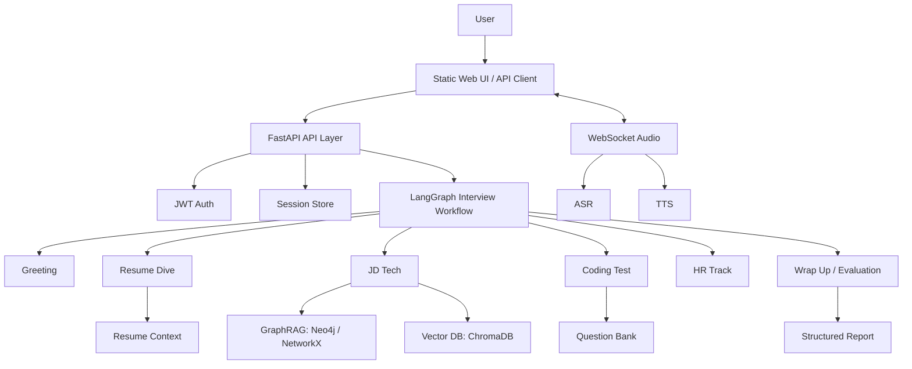
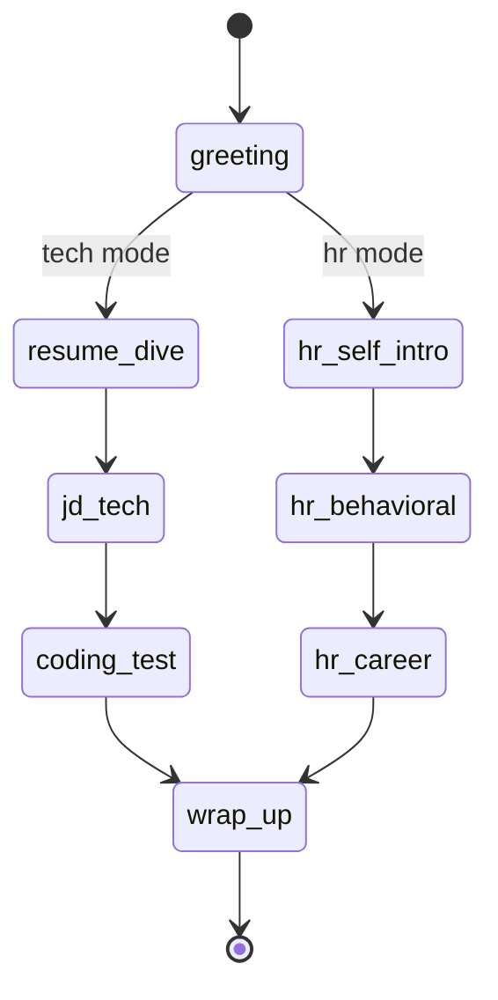

# InterviewAgent

AI 面试 Agent 系统：基于 LangGraph、GraphRAG、实时语音和结构化评测，模拟技术面与 HR 面试流程，并生成可解释的能力评估报告。

这个项目的目标不是做一个简单聊天机器人，而是把“面试官”拆成可编排、可追踪、可评估的 Agent 工作流：上传简历和 JD 后，系统会解析候选人背景，按阶段推进面试，结合知识图谱和题库检索生成追问，最后输出评分、薄弱项、参考答案和学习建议。

## 核心能力

- **多阶段 Agent 工作流**：使用 LangGraph 编排开场、简历深挖、JD 技术考察、编程题、HR 行为面、总结评估等阶段。
- **GraphRAG 技术追问**：融合知识图谱、BM25、向量检索和 RRF 排序，根据 JD 技术点生成更有层次的追问链。
- **实时多模态交互**：支持文本接口、SSE 流式输出、WebSocket 语音输入、ASR 和 TTS 播放。
- **结构化面试评估**：按阶段记录 QA，基于 rubric 生成多维能力评分、弱项题目、标准答案和学习建议。
- **自主阶段练习**：用户可以在自己的 session 内选择想练习的面试阶段，例如简历深挖、JD 技术考察、编程题或 HR 行为面。
- **多用户与会话管理**：提供注册登录、JWT 认证、会话状态存储、历史报告查询等基础能力。
- **数据库持久化起步**：面试 session 元数据和对话 transcript 写入 SQL 表，Redis/内存继续承担活跃 Agent 状态。
- **可本地降级运行**：Neo4j 不可用时可回退到 NetworkX 图谱后端；Redis 不配置时使用内存会话存储，便于开发调试。

## 技术栈

| 模块 | 技术 |
| --- | --- |
| 后端 API | FastAPI, Pydantic |
| Agent 编排 | LangGraph, LangChain |
| LLM | Qwen / DashScope OpenAI-compatible API |
| 知识图谱 | Neo4j, NetworkX fallback |
| 检索 | ChromaDB, BM25, SentenceTransformer, RRF |
| 语音 | DashScope ASR/TTS, WebSocket |
| 存储 | SQLite, Redis, JSON session archive |
| 观测 | Loguru, LangSmith hooks |
| 测试 | pytest, pytest-asyncio |

## 系统架构



## 面试流程



## 快速开始

### 1. 准备环境变量

复制样例配置：

```bash
cp .env.example .env
```

至少需要填写：

```env
DASHSCOPE_API_KEY=your_dashscope_api_key
SECRET_KEY=replace_with_a_long_random_secret
NEO4J_PASSWORD=replace_with_a_local_password
```

本地开发可以先使用轻量模式：

```env
GRAPH_BACKEND=networkx
REDIS_URL=
```

生产环境必须显式配置安全项：

```env
APP_ENV=production
SECRET_KEY=replace_with_a_real_long_random_secret
REDIS_URL=redis://redis:6379/0
CORS_ALLOWED_ORIGINS=https://your-domain.com
```

### 2. 安装依赖

```bash
python -m venv .venv
.venv/Scripts/activate
pip install -r requirements.txt
```

### 3. 启动依赖服务

```bash
docker compose up -d neo4j redis
```

如果只想快速调试 Agent 流程，可以先使用 `GRAPH_BACKEND=networkx`，跳过 Neo4j 初始化。

### 4. 初始化检索数据

```bash
python scripts/init_neo4j.py
python scripts/init_vector_db.py
```

### 5. 启动 API

```bash
python -m app.main
```

访问：

- Web UI: http://localhost:8000
- Health check: http://localhost:8000/health
- API docs: http://localhost:8000/docs

## Docker 运行

```bash
docker compose up --build
```

容器启动后访问 http://localhost:8000。

## API 使用顺序

1. `POST /api/v1/auth/register` 注册用户。
2. `POST /api/v1/auth/login` 获取 Bearer token。
3. `POST /api/v1/upload/` 上传简历和 JD，创建面试 session。
4. `POST /api/v1/interview/start` 生成开场问题。
5. `POST /api/v1/interview/{session_id}/turn` 进行文本面试。
6. `POST /api/v1/interview/{session_id}/set_phase` 可在自己的 session 内选择练习阶段，完整流程和专项练习都支持。
7. `GET /api/v1/interview/{session_id}/report` 查看最终报告。

上传时可选择完整面试或专项练习：

```text
flow_mode=full_interview
flow_mode=phase_practice&selected_phase=jd_tech
```

`phase_practice` 会从 `selected_phase` 开始；`full_interview` 默认从 `greeting` 开始，但用户仍可在过程中主动切换到合法阶段。

语音链路使用：

```text
ws://localhost:8000/api/v1/ws/audio/{session_id}?token={jwt_token}
```

## 测试

轻量验证不依赖完整 ML/RAG/音频依赖，适合每次提交前快速运行：

```bash
python scripts/verify_fast.py
```

它会执行：

- `compileall` 语法检查
- 标准库 `unittest` 安全边界测试
- README、`.env.example`、Compose 和 docs 的敏感值扫描

完整测试需要安装全部项目依赖：

```bash
pytest tests -q
```

当前测试重点覆盖 LangGraph 阶段流转、节点工具函数和部分节点行为。后续会继续补齐 API 权限、会话隔离、RAG 质量评估和报告稳定性测试。

## 项目结构

```text
app/
  agents/          LangGraph 节点与工具
  api/             FastAPI 路由
  audio/           ASR / TTS / WebSocket 音频处理
  auth/            JWT 登录认证
  core/            状态机、会话存储、全局状态
  db/              SQLite 数据库模型
  evaluation/      面试评分与报告生成
  rag/             GraphRAG、向量库、简历解析
  mcp/             MCP 工具封装
data/
  question_bank/   面试题库
  tech_knowledge_graph.json
scripts/
  init_neo4j.py
  init_vector_db.py
static/
  index.html
tests/
```

## 上线前升级路线

### Phase A: 展示与可复现

- 修复 README、注释和配置样例乱码。
- 补齐 Dockerfile、`.dockerignore` 和 Docker Compose 启动说明。
- 明确架构图、API 调用流程、演示脚本和测试命令。

### Phase B: 生产安全与数据边界

- 所有 session 接口校验 `user_id`，避免越权读取。
- 已将 session 元数据和 transcript message 写入数据库；下一步将 turn、evaluation report 数据库化，Redis 只做热状态缓存。
- 增加生产配置校验：禁止默认 `SECRET_KEY`、全开放 CORS 和不安全运行模式。
- 保留用户自主选择面试阶段能力，但必须校验 session 所有权和合法阶段。
- 补齐限流、上传大小限制、文件类型校验、超时和重试策略。

### Phase C: Agent 与 RAG 质量闭环

- 建立 RAG eval 数据集，度量 Recall@K、MRR、问题相关性和 GraphRAG 对比收益。
- 建立 Agent workflow eval，度量阶段转场准确率、追问质量、重复提问率和报告 JSON 稳定性。
- 接入结构化 trace、token 成本、ASR/TTS 延迟、LLM 失败率和端到端会话成功率。

## 简历描述参考

> 设计并实现生产级多模态 AI 面试 Agent 系统，基于 LangGraph 编排多阶段面试工作流，融合 Neo4j 知识图谱、BM25、向量检索与 RRF 排序构建 GraphRAG 技术追问链，支持实时语音交互、结构化能力评估、多用户会话管理和可解释面试报告。
